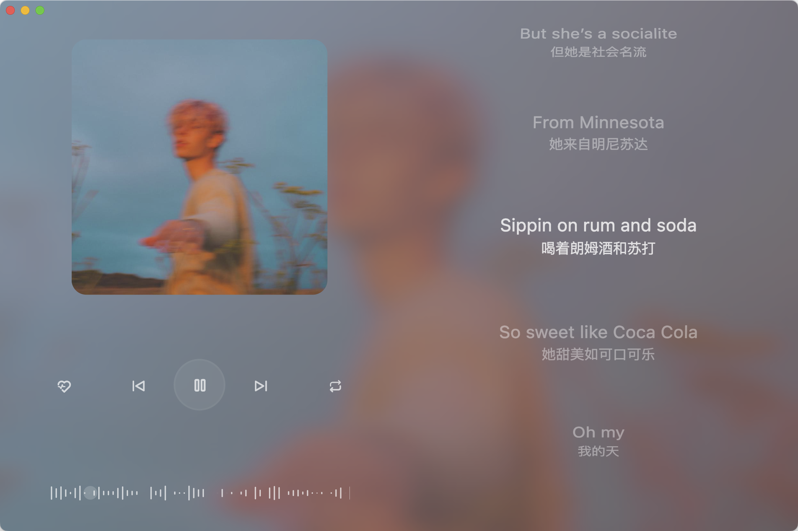
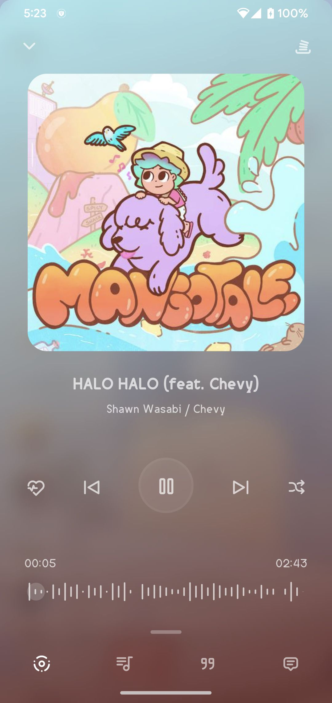

<h1 align="center">bujuan</h1>

一个支持Android、iOS、MacOS、Windows、Linux的三方网易云播放器。

#### MacOS (适配中)	

#### Android & IOS (UI一致)

|  |  |  |
| --------------------------------------------------------- | --------------------------------------------------------- | --------------------------------------------------------- |

## 功能介绍
- 采用flutter开发，可打包编译为所有平台，采用Skia作为2D渲染引擎，Dart语言作为运行，性能可媲美原生。

- 集成Rust版[UnblockNeteaseMusic](https://github.com/UnblockNeteaseMusic/server-rust),可以获取灰色歌曲音源。

- Api参考于开源项目 [NeteaseCloudMusicApi](https://github.com/Binaryify/NeteaseCloudMusicApi) 。

- 播放器尽量做到简洁美观（由于是个人项目，没有专业的ui设计，适配上面可能暂时会有一些问题。）

- 播放页面模仿YouTube Music，动画流畅精美。

- 网易云账号登录（邮箱、二维码）。

- 每日推荐、私人Fm、电台、云盘。

- 歌手、专辑、搜索

- 去除无用功能，专注于用户音乐。

- 本地音乐已从该版本剔除（考虑后期制作一个单独的本地版本）。

  

### 开发进度

- ✅ Android & IOS 基本已经完善剩余Bug修复和新增功能
- ☑️ MacOS 正在适配中（届时和横屏模式同时推出）
- ☑️Windows
- ☑️Linux

### 代码部署编译

- 需提前准备好[Flutter](https://flutter.cn/)、[Rust](https://www.rust-lang.org/)环境。
- 关于Rust使用开源项目[flutter_rust_bridge](https://github.com/fzyzcjy/flutter_rust_bridge)，请参考。
- `flutter pub get`
- `flutter build apk --release`
- `flutter build ios`
- `flutter build macos`
