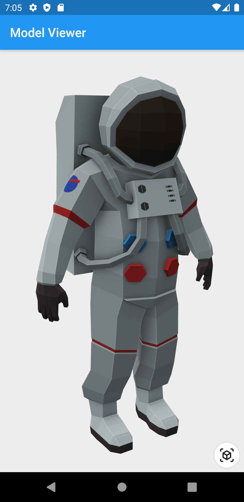
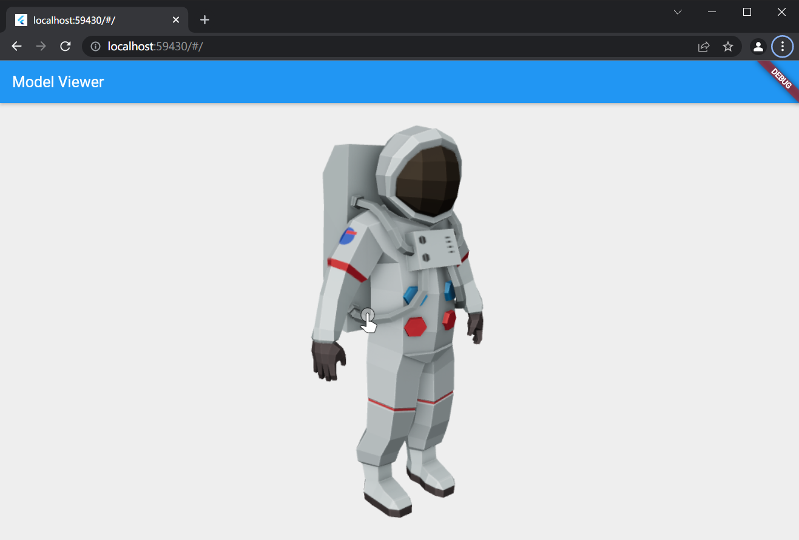

# 3D Model Viewer for Flutter

<https://pub.dev/packages/model_viewer> - Fork from a package that is discontinued,
and add the web support for it.

This is a [Flutter](https://flutter.dev) widget for rendering interactive
3D models in the [glTF](https://www.khronos.org/gltf/) and
[GLB](https://wiki.fileformat.com/3d/glb/) formats.

The widget embeds Google's [`<model-viewer>`](https://modelviewer.dev)
web component in a [WebView](https://pub.dev/packages/webview_flutter).

## Screenshot




## Compatibility

- Android
- iOS (AR View may not avaliable on iOS 16+)
- Web, with [a recent system browser version](https://modelviewer.dev/#section-browser-support).

## Notes

We use the [Google APP](https://play.google.com/store/apps/details?id=com.google.android.googlequicksearchbox), `com.google.android.googlequicksearchbox` to display interactive 3D models on Android. The model displays in 'ar_preferred' mode by default, Scene Viewer launches in AR native mode as the entry mode. If [Google Play Services for AR (ARCore, `com.google.ar.core`)](https://play.google.com/store/apps/details?id=com.google.ar.core) isn't present, Scene Viewer gracefully falls back to 3D mode as the entry mode.

## Installation

### `pubspec.yaml`

```yaml
dependencies:
   model_viewer_plus: ^(newest from https://pub.dev/packages/model_viewer_plus)
```

### `AndroidManifest.xml` (Android 9+ only)

To use this widget on Android 9+ devices, your app must be permitted to make
an HTTP connection to `http://localhost:XXXXX`. Android 9 (API level 28)
changed the default for [`android:usesCleartextTraffic`] from `true` to
`false`, so you will need to configure your app's
`android/app/src/main/AndroidManifest.xml` as follows:

```diff
--- a/example/android/app/src/main/AndroidManifest.xml
+++ b/example/android/app/src/main/AndroidManifest.xml
@@ -8,7 +8,8 @@
     <application
         android:name="io.flutter.app.FlutterApplication"
         android:label="model_viewer_example"
-        android:icon="@mipmap/ic_launcher">
+        android:icon="@mipmap/ic_launcher"
+        android:usesCleartextTraffic="true">
         <activity
             android:name=".MainActivity"
             android:launchMode="singleTop"
```

This does not affect Android 8 and earlier. See [#7] for more information.

### `app/build.gradle` (Android only)

Change minSdkVersion to 19.

    defaultConfig {
        // TODO: Specify your own unique Application ID (https://developer.android.com/studio/build/application-id.html).
        applicationId "com.example.lab_rat"
        minSdkVersion 19
        targetSdkVersion flutter.targetSdkVersion
        versionCode flutterVersionCode.toInteger()
        versionName flutterVersionName
    }

### `Info.plist` (iOS only)

To use this widget on iOS, you need to opt-in to the embedded views preview
by adding a boolean property to your app's `ios/Runner/Info.plist` file, with
the key `io.flutter.embedded_views_preview` and the value `YES`:

```xml
<key>io.flutter.embedded_views_preview</key>
<true/>
```

### `web/index.html` (Web only)

Modify the `<head>` tag of your `web/index.html` to load the JavaScript, like so:

```html
<head>

  <!-- Other stuff -->

  <script type="module" src="./assets/packages/model_viewer_plus/assets/model-viewer.min.js" defer></script>
</head>
```

`./assets/packages/model_viewer_plus/assets/model-viewer.min.js` will use the default js file which is included in this package's asset. The [official site](https://modelviewer.dev) uses unpkg, by using `https://unpkg.com/@google/model-viewer/dist/model-viewer.min.js`, you are using the latest version of `<model-viewier>`. You may replace the
value of `src` attribute with another CDN mirror's URL. But please notice that our model-viewer-plus maybe not able to keep up with the `<model-viewier>`'s latest version.

According to [#44](https://github.com/omchiii/model_viewer_plus.dart/issues/44), the render quality maybe low on some mobile devices. Please consider adding `<meta name="viewport" content="width=device-width, initial-scale=1" />` to the `<head>` of your `web/index.html`.

## Features

- Renders glTF and GLB models. (Also, [USDZ] models on iOS 12+.)

- Supports animated models, with a configurable auto-play setting.

- Optionally supports launching the model into an [AR] viewer.

- Optionally auto-rotates the model, with a configurable delay.

- Supports a configurable background color for the widget.

[USDZ]: https://graphics.pixar.com/usd/docs/Usdz-File-Format-Specification.html
[AR]:   https://en.wikipedia.org/wiki/Augmented_reality

## Examples

### Importing the library

```dart
import 'package:model_viewer_plus/model_viewer_plus.dart';
```

### Creating a `ModelViewer` widget

```dart
class MyApp extends StatelessWidget {
  @override
  Widget build(BuildContext context) {
    return MaterialApp(
      home: Scaffold(
        appBar: AppBar(title: Text("Model Viewer")),
        body: ModelViewer(
          src: 'https://modelviewer.dev/shared-assets/models/Astronaut.glb',
          alt: "A 3D model of an astronaut",
          ar: true,
          autoRotate: true,
          cameraControls: true,
        ),
      ),
    );
  }
}
```

### Loading a bundled Flutter asset

```dart
class MyApp extends StatelessWidget {
// ...
          src: 'assets/MyModel.glb',
// ...
}
```

### Loading a model from the file system

This is not avaliable on Web.

```dart
class MyApp extends StatelessWidget {
// ...
          src: 'file:///path/to/MyModel.glb',
// ...
}
```

### Loading a model from the web

```dart
class MyApp extends StatelessWidget {
// ...
          src: 'https://modelviewer.dev/shared-assets/models/Astronaut.glb',
// ...
}
```

Note that due to browsers' [CORS] security restrictions, the model file
*must* be served with a `Access-Control-Allow-Origin: *` HTTP header.

## Frequently Asked Questions

### Q: Why do I get the error `net::ERR_CLEARTEXT_NOT_PERMITTED`?

You didn't configure your `AndroidManifest.xml` as per the installation
instructions earlier in this document. See also [#7].

### Q: Why does the example app just show a blank screen?

**A:** Most likely, the platform browser version on your device or emulator is
too old and does not support the features that Model Viewer needs.

For example, the stock Chrome version on the Android 10 emulator is too old
and will display a blank screen; it must be upgraded from the Play Store in
order to use this package. (The stock Chrome version on the Android 11
emulator works fine, however.) See [google/model-viewer#1109].

### Q: Why doesn't my 3D model load and/or render?

**A:** There are several reasons why your model URL could fail to load and
render:

1. It might not be possible to load the model URL due to [CORS] security
   restrictions. The server hosting the model file *must* send appropriate
   CORS response headers for Model Viewer to be able to load the file.
   See [google/model-viewer#1015].

2. It might not be possible to parse the provided glTF or GLB file.
   Some tools can produce invalid files when exporting glTF. Always
   run your model files through the [glTF Validator] to check for this.

3. The platform browser might not support the features that Model Viewer
   needs. See [google/model-viewer#1109].

[#7]:                       https://github.com/drydart/model_viewer.dart/issues/7
[CORS]:                     https://developer.mozilla.org/en-US/docs/Web/HTTP/CORS
[glTF Validator]:           https://github.khronos.org/glTF-Validator/
[google/model-viewer#1015]: https://github.com/google/model-viewer/issues/1015
[google/model-viewer#1109]: https://github.com/google/model-viewer/issues/1109
[`android:usesCleartextTraffic`]: https://developer.android.com/guide/topics/manifest/application-element#usesCleartextTraffic
